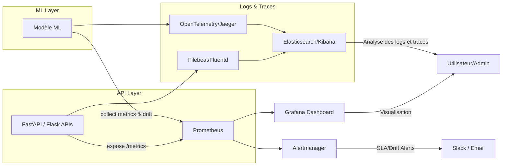

# 📊 Monitoring-Observabilite
la partie Monitoring &amp; Observabilité (User Stories 7.1 &amp; 7.2) du projet de plateforme de scoring/prediction ML. Cette structure combine la surveillance des performances API (Prometheus + Grafana) et la détection de dérive des modèles (EvidentlyAI).

---
## ♻️ Flux de Monitoring



---

## 🧩 Description 
Ce module implémente la surveillance des performances des APIs et des modèles ML dans la plateforme de scoring/fraude. Il couvre trois aspects principaux : 
1. **Monitoring des APIs (User Story 7.1)** 
    - Collecte des métriques temps de réponse, taux d’erreur et SLA.
    - Visualisation via Grafana.
    - Alertes automatiques si SLA dépassé (> 2s).
2. **Détection dela dérive des modèles ML (User Story 7.2)**
    - Surveillance des distributions des features entre les données d’entraînement et la production.
    - Génération de rapports HTML/JSON via EvidentlyAI.
    - Alerte automatique en cas de dérive significative (`drift_score > seuil`).
3. **Centralisation des logs et traces (User Story 7.3)**
    - Collecte centralisée des logs des APIs et modèles.
    - Visualisation via Kibana et suivi des traces avec Jaeger/OpenTelemetry.
    - Alertes sur erreurs critiques.
---

## 📂 Arborescence

```bash
monitoring_observability/
│
├── prometheus/
│   ├── prometheus.yml                   # Configuration principale de Prometheus (targets, scrape interval, alert rules)
│   ├── alert_rules.yml                  # Règles d’alerte (SLA, latence API > 2s)
│   ├── docker-compose.yml               # Déploiement de Prometheus + Grafana via Docker
│   └── exporters/
│       ├── node_exporter/               # Collecte métriques système (CPU, mémoire, disque)
│       │   └── dockerfile
│       ├── fastapi_exporter/            # Exporter métriques depuis FastAPI (via /metrics)
│       │   ├── metrics_collector.py     # Collecte des métriques d’API (temps de réponse, erreurs, trafic)
│       │   └── requirements.txt
│       └── kafka_exporter/              # Optionnel : métriques Kafka si utilisé
│           └── dockerfile
│
├── grafana/
│   ├── dashboards/
│   │   ├── api_performance.json         # Dashboard pour temps de réponse, taux d’erreur, SLA
│   │   ├── system_metrics.json          # Dashboard CPU/mémoire du conteneur ou serveur
│   │   └── model_drift.json             # Dashboard de suivi des dérives du modèle
│   ├── datasources/
│   │   └── prometheus.yml               # Source de données Prometheus pour Grafana
│   └── provisioning/
│       ├── dashboards.yaml              # Configuration d’import automatique des dashboards
│       └── datasources.yaml             # Configuration automatique de la datasource Prometheus
│
├── model_drift_monitoring/
│   ├── evidently/
│   │   ├── drift_monitor.py             # Script principal pour comparer les distributions (train vs prod)
│   │   ├── report_generator.py          # Génère rapports HTML Evidently
│   │   ├── drift_alerts.py              # Génère alertes dérive (via logs, Slack, Prometheus Pushgateway…)
│   │   └── config_drift.yaml            # Paramètres des features à surveiller (seuils, fréquence)
│   │
│   ├── reports/
│   │   ├── drift_report_latest.html     # Rapport Evidently récent (mis à jour automatiquement)
│   │   ├── drift_history/               # Historique des rapports générés
│   │   │   ├── 2025-10-10_drift.html
│   │   │   └── 2025-10-11_drift.html
│   │
│   └── notebooks/
│       └── explore_drift.ipynb          # Exploration manuelle de la dérive (EDA des distributions)
│
├── alerting/
│   ├── slack_alerts.py                  # Envoi d’alertes Prometheus/Evidently vers Slack ou email
│   ├── alertmanager.yml                 # Configuration d’Alertmanager (canaux, routes, templates)
│   └── templates/
│       └── alert_template.tmpl          # Modèle message alerte (SLA, dérive, erreurs API)
│
├── tests/
│   ├── test_prometheus_config.py        # Vérifie la validité du fichier prometheus.yml
│   ├── test_grafana_dashboards.py       # Vérifie la présence et la syntaxe JSON des dashboards
│   ├── test_evidently_drift.py          # Vérifie le bon fonctionnement du drift monitor
│   └── test_alerts.py                   # Vérifie l’envoi des alertes (mock Slack/mail)
│
└── README.md                            # Documentation du module Monitoring & Observabilité
```

---

## ⚙️ Déploiement

1. Installer Docker et Docker-Compose.
2. Lancer la stack monitoring :
```bash
docker-compose up -d
```
3. Accéder aux dashboards :

    - **Grafana** : http://localhost:3000
    - **Prometheus** : http://localhost:9090
    - **Kibana** : http://localhost:5601
    - **Jaeger** : http://localhost:16686

4. Vérifier les métriques exposées :
    - ``/metrics`` pour APIs et modèles
    - ``model_drift_score`` pour suivi dérive ML

---

## 📌 Notes

- Les dashboards Grafana sont préconfigurés pour afficher :
    - Temps de réponse API (moyenne, p95, p99)
    - Taux d’erreurs 4xx/5xx
    - Score de dérive du modèle
- Les alertes peuvent être configurées via Prometheus Alertmanager pour Slack, Email ou PagerDuty.
- Les rapports Evidently sont générés automatiquement dans ``model_drift_monitoring/reports/``.
